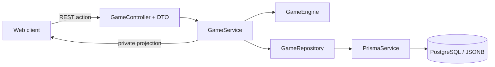
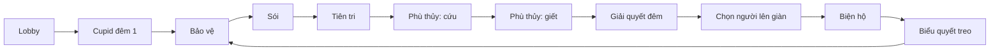

# Ma Sói — Backend project

## Mục tiêu

Backend NestJS này vận hành một ván Ma Sói không cần người quản trò xử lý luật. Người chơi thảo luận qua kênh bên ngoài; web chỉ nhận lựa chọn, điều phối lượt, giữ thông tin bí mật và giải quyết kết quả trên server.

Game engine tách khỏi HTTP. Mọi luật nằm trong `src/game/domain/game-engine.ts`; REST controller chỉ chuyển lệnh vào engine và trả về một bản trạng thái đã lọc theo từng người chơi. Trạng thái ván được lưu trong PostgreSQL dưới dạng JSONB qua Prisma, vì vậy server có thể khởi động lại mà không làm mất phòng.

## Chạy dự án

```bash
npm install
Copy-Item .env.example .env
npm run db:up
npm run prisma:deploy
npm run start:dev
```

API chạy tại `http://localhost:3000/api`. Swagger UI chạy tại `http://localhost:3000/docs` và OpenAPI JSON tại `http://localhost:3000/docs/openapi.json`.

```bash
npm test
npm run test:e2e
npm run build
```

PostgreSQL chạy bằng Docker ở cổng host `55432` để không xung đột với các dịch vụ local đang dùng cổng `5432`. `playerId` trong body/query đang là định danh phát triển; trước khi triển khai thật cần thay bằng session hoặc JWT để người chơi không thể đọc view của người khác.

## Deploy bằng Docker Compose

Commit `Dockerfile`, `docker-compose.yml`, `prisma/migrations/` và `.env.example`; không commit `.env` hoặc Docker volume. Người clone repository có thể tạo cấu hình riêng rồi deploy cả API và database:

```powershell
Copy-Item .env.example .env
# Đổi POSTGRES_PASSWORD trong .env trước khi deploy thật
docker compose up -d --build
```

Compose tạo volume `postgres_data` để dữ liệu PostgreSQL còn nguyên khi container khởi động lại. Service `api` chờ database healthy, chạy `prisma migrate deploy`, rồi mới khởi động NestJS. Khi code có thay đổi schema, tạo và commit migration mới bằng `npm run prisma:migrate`; host deploy sẽ tự áp dụng migration đó ở lần `docker compose up -d --build` kế tiếp.

Git không lưu dữ liệu trong volume hiện tại. Nếu cần chuyển cả các phòng/ván đang có sang máy hoặc host khác, tạo backup rồi phục hồi sau khi deploy:

```powershell
docker compose exec -T db pg_dump -U werewolf werewolf > werewolf.sql
docker compose exec -T db psql -U werewolf -d werewolf < werewolf.sql
```

## Kiến trúc



- `GameController`: API tạo phòng, vào phòng, bắt đầu, gửi hành động và lấy view. Mỗi endpoint nhận DTO đã được validation và được mô tả trong Swagger.
- `GameService`: quản lý phòng, chia vai, gọi engine, lưu state và dựng dữ liệu trả về theo người nhận.
- `GameEngine`: kiểm tra lượt, quyền, mục tiêu, tử vong, chuyển hóa và chiến thắng.
- `domain/game.types.ts`: role, phe, phase và kiểu state dùng chung.
- `GameRepository`: lớp truy cập dữ liệu duy nhất cho module game.
- `PrismaModule`: khởi tạo và đóng kết nối Prisma một lần cho toàn app.

```text
src/
  config/swagger.config.ts
  database/prisma.module.ts
  database/prisma.service.ts
  game/
    domain/                 # Game engine thuần và kiểu nghiệp vụ
    dto/                    # DTO + class-validator + Swagger metadata
    repositories/           # Prisma persistence adapter
    game.controller.ts
    game.service.ts
    game.module.ts
prisma/schema.prisma
prisma/migrations/
docker-compose.yml
```

Server là nguồn dữ liệu duy nhất. Client không nhận role, mục tiêu cắn, bảo vệ, thuốc hay phiếu bầu bí mật của người khác.

## Các vai và phe

| Vai | Ban đầu | Hành động |
|---|---|---|
| Dân | Phe dân | Không có hành động đêm; biểu quyết ban ngày |
| Sói | Phe sói | Cùng nhóm sói chốt một mục tiêu cắn mỗi đêm |
| Tiên tri | Phe dân | Soi một người khác còn sống; nhận `SÓI` hoặc `KHÔNG PHẢI SÓI` |
| Bảo vệ | Phe dân | Bảo vệ một người khỏi vết cắn; không chọn trùng mục tiêu đêm liền trước |
| Kẻ ngốc | Phe kẻ ngốc | Thắng ngay nếu bị treo cổ hợp lệ |
| Kẻ bị nguyền | Phe dân | Bị sói cắn mà không được cứu/bảo vệ thì hóa Sói thay vì chết |
| Phù thủy | Phe dân | Một bình cứu và một bình giết cho toàn ván |
| Cupid | Phe dân trước khi ghép | Đêm đầu ghép hai người thành tình nhân |

Sau khi mọi người đã vào phòng, chủ phòng cấu hình **thành phần role của ván**: chọn số bản sao của từng role muốn dùng. Danh sách `roles` có số phần tử bằng số người chơi, nhưng không gắn phần tử nào với một người cụ thể. Không có role bắt buộc, điểm cân bằng, tỷ lệ Sói hay giới hạn số lần xuất hiện của role. Server chỉ kiểm tra số lượng role khớp số người đang ở trong phòng, sau đó xáo ngẫu nhiên danh sách này trước khi chia vai để chủ phòng không biết ai nhận vai nào.

## Trạng thái vòng chơi



Các lượt của vai đã chết, không có trong cấu hình, hoặc hết tài nguyên sẽ được engine tự bỏ qua. Trạng thái chung công khai role đang có lượt trong đêm để cả phòng biết tiến trình ván; mục tiêu, lựa chọn và kết quả riêng vẫn không được công khai.

### Đêm đầu và các đêm sau

- Đêm đầu: Cupid (nếu còn sống và chưa dùng) → Bảo vệ → Sói → Tiên tri → Phù thủy cứu → Phù thủy giết → tổng kết.
- Từ đêm thứ hai: Bảo vệ → Sói → Tiên tri → Phù thủy cứu → Phù thủy giết → tổng kết.
- Mỗi Sói còn sống bỏ phiếu một lần cho mục tiêu cắn. Các Sói thấy lựa chọn hiện tại của nhau qua private view; khi đủ phiếu, mục tiêu nhiều phiếu nhất bị cắn. Nếu các mục tiêu cao nhất hòa nhau, server chọn ngẫu nhiên một trong số đó.
- Các phase Bảo vệ, Sói, Tiên tri, Phù thủy cứu và Phù thủy giết luôn xuất hiện công khai theo đúng thứ tự, kể cả khi role tương ứng đã chết hoặc Phù thủy đã hết thuốc. Khi không còn người có thể hành động, chủ phòng dùng `ADVANCE_NIGHT` để chuyển phase mà không làm lộ lý do.
- Bảo vệ chỉ chặn vết cắn của Sói. Không chặn đầu độc, treo cổ hoặc chết theo tình nhân.
- Bảo vệ được tự bảo vệ; không được bảo vệ cùng một người trong hai đêm liên tiếp.
- Bảo vệ có sổ lịch sử riêng theo đêm, ghi lại người mình đã bảo vệ; không nhận kết quả có chặn được vết cắn hay không.
- Tiên tri có sổ lịch sử riêng theo đêm. Kết quả là vai hiện tại tại thời điểm soi; lịch sử cũ không thay đổi.
- Phù thủy chỉ biết mục tiêu bị cắn trong lượt cứu nếu bình cứu còn. Dùng bình cứu chỉ cứu vết cắn đêm đó. Hết bình cứu thì không nhận mục tiêu cắn nữa, nhưng vẫn có thể dùng bình giết nếu còn.
- Phù thủy có thể chọn không dùng từng bình và được dùng cả hai bình trong một đêm.
- Nếu một người được bảo vệ/cứu nhưng bị bình giết, người đó vẫn chết.

### Kẻ bị nguyền và bí mật thông tin

- Kẻ bị nguyền nhận vết cắn có hiệu lực: không chết, đổi role hiện tại thành Sói.
- Nếu vết cắn bị bảo vệ hoặc bình cứu chặn, người đó không chuyển hóa.
- Sáng hôm sau chỉ công bố danh sách người bị loại hoặc “Không có ai bị loại”, không nêu nguyên nhân hay chuyển hóa.
- Khi đêm tiếp theo bắt đầu, chỉ kẻ bị nguyền đã hóa Sói, các Sói còn sống và người yêu của họ nhận thông báo riêng. Các Sói thấy thành viên mới trong nhóm. Tiên tri phải tự soi lại để biết; không ai khác được báo.
- Chuyển hóa được lưu server-side ngay ở lúc tổng kết để engine tính luật đúng, nhưng private projection giấu role/phe mới cho tới đêm kế tiếp.

## Cupid và tình nhân

- Cupid chỉ ghép đôi một lần trong đêm đầu. Hai tình nhân biết tên, vai và phe của nhau qua private view.
- Một người trong cặp chết thì người còn lại chết theo ngay. Bảo vệ và bình cứu không chặn chết theo.
- Cupid ghép hai người khác: Cupid trở thành phe dân sau khi dùng kỹ năng. Hai người cùng phe dân ở phe dân; hai người cùng phe sói ở phe sói; hai phe khác nhau ở phe tình nhân độc lập.
- Bất kỳ cặp nào có Kẻ ngốc — ghép Kẻ ngốc với Sói, Dân hoặc Cupid — trở thành phe Tình nhân độc lập. Họ chỉ thắng theo điều kiện thắng của tình nhân khi cả hai còn sống. Nếu Kẻ ngốc bị treo cổ, chỉ riêng Kẻ ngốc thắng; người yêu chết theo nhưng không thắng. Nếu người yêu bị loại, Kẻ ngốc chết theo và không thể thắng.
- Cặp Kẻ bị nguyền và Dân bắt đầu ở phe Dân; khi Kẻ bị nguyền hóa Sói, cả cặp chuyển sang phe Tình nhân độc lập. Cặp Kẻ bị nguyền và Sói bắt đầu ở phe Tình nhân độc lập; khi Kẻ bị nguyền hóa Sói, cả cặp chuyển sang phe Sói.
- Khi Kẻ bị nguyền trong cặp hóa Sói, phe cặp được tính lại. Thông tin thay đổi chỉ tới những người liên quan như phần trên.
- Tình nhân độc lập thắng khi cả hai còn sống và **tổng số người sống đúng 4**.

Trong bản hiện tại, nếu Cupid ghép hai người khác mà một trong họ là Kẻ ngốc, engine coi đó là cặp khác phe và chuyển hai người sang phe tình nhân độc lập. Đây là quy ước cần giữ nguyên hoặc đổi rõ ràng trước khi mở rộng rule set.

## Ban ngày

1. Server công bố người bị loại, không công khai role.
2. Mọi người còn sống bỏ phiếu một lần chọn một người khác lên giàn. Không có phiếu trắng và không được tự chọn mình.
3. Nếu hòa ở vị trí cao nhất, ngày kết thúc ngay và chuyển sang đêm.
4. Người lên giàn biện hộ qua kênh bên ngoài. Chủ phòng hiện có thể kết thúc thời gian biện hộ bằng API; khi có WebSocket/timer, server sẽ gọi cùng action này theo thời lượng phòng.
5. Mọi người còn sống trừ người trên giàn chọn một lần `Treo cổ` hoặc `Không treo`.
6. Chỉ treo khi số phiếu Treo cổ lớn hơn một nửa số người đủ quyền biểu quyết. Hòa hoặc không quá bán thì người đó sống và đêm mới bắt đầu.

Kẻ ngốc chỉ thắng khi vòng 5 thông qua treo cổ, không chỉ vì đã lên giàn. Khi Kẻ ngốc thắng, ván kết thúc ngay; Cupid ghép với Kẻ ngốc cùng thắng theo phe này.

## Điều kiện thắng

Engine kiểm tra sau khi xử lý xong toàn bộ cái chết liên quan, theo thứ tự:

1. Kẻ ngốc bị treo cổ: phe Kẻ ngốc thắng và ván kết thúc ngay.
2. Tình nhân độc lập: hai người còn sống và còn đúng bốn người sống.
3. Dân: không còn người sống thuộc **phe Sói**.
4. Sói: số người sống phe Sói bằng hoặc lớn hơn tổng số người sống ngoài phe Sói.

Điều kiện dân dựa vào `faction` hiện tại, không dựa vào role. Vì vậy Sói thuộc phe tình nhân độc lập không ngăn phe Dân thắng theo luật đã chốt.

Sau khi ván kết thúc, API trả `finalRoles` để công khai role và phe cuối ván; trong ván không có role nào được công khai khi chết.

## REST API hiện có

Tất cả request body và query được kiểm tra bởi `ValidationPipe` toàn cục (`whitelist`, `forbidNonWhitelisted`, `transform`). Chi tiết schema, enum action và ví dụ request có tại Swagger UI `/docs`.

| Endpoint | Mục đích |
|---|---|
| `POST /api/games` | Tạo phòng: `{ hostName }` |
| `POST /api/games/:gameId/join` | Vào phòng: `{ name }` |
| `POST /api/games/:gameId/configuration` | Chủ phòng lưu thành phần role: `{ playerId, roles }`; số phần tử `roles` phải bằng số người chơi |
| `POST /api/games/:gameId/start` | Chủ phòng bắt đầu: `{ playerId }` |
| `POST /api/games/:gameId/actions` | Gửi action: `{ playerId, type, targetId?, targetIds?, use? }` |
| `GET /api/games/:gameId/view?playerId=...` | Lấy public state và private state của đúng người chơi |

Các `type` được hỗ trợ: `PAIR_LOVERS`, `PROTECT`, `VOTE_WOLF_TARGET`, `INSPECT`, `USE_HEAL`, `USE_POISON`, `NOMINATE`, `END_DEFENSE`, `VOTE_EXECUTION`, `ADVANCE_NIGHT`.

Ví dụ tạo phòng:

```json
{
  "hostName": "An"
}
```

Ví dụ cấu hình role sau khi có năm người:

```json
{
  "playerId": "host-id",
  "roles": ["WOLF", "VILLAGER", "SEER", "GUARD", "FOOL"]
}
```

Ví dụ Sói đề xuất và chốt mục tiêu:

```json
{ "playerId": "wolf-id", "type": "VOTE_WOLF_TARGET", "targetId": "target-id" }
```


## Việc cần làm trước production

- Thêm JWT/session; lấy `playerId` từ credential thay vì request body/query.
- Thêm WebSocket gateway để push private projection tới đúng socket và cập nhật public state cho cả phòng.
- Thêm bộ hẹn giờ server-side cho lượt, biện hộ, tạm dừng và khôi phục kết nối. Lượt Sói không được tự hết hạn khi chưa chốt mục tiêu.
- Thêm transaction hoặc optimistic locking cho mỗi action, rate limit, audit event chỉ lưu ở server và idempotency key cho action gửi lại do mạng chập chờn.
- Thêm Prisma migration cho mọi thay đổi schema; không dùng `prisma db push` ở production.
- Bổ sung test ma trận tương tác: chết dây chuyền, tình nhân có Kẻ bị nguyền, hai thuốc cùng đêm, bảo vệ liên tiếp, điều kiện đúng bốn người và lọc dữ liệu bí mật.
